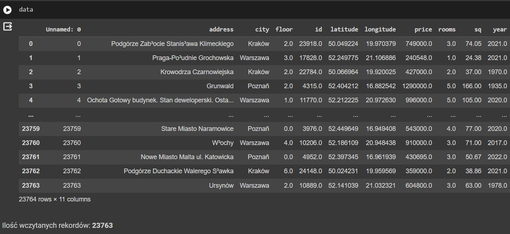
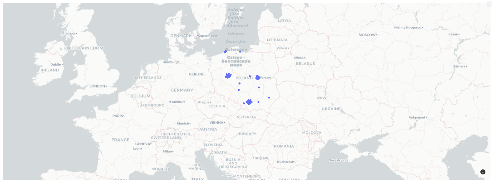
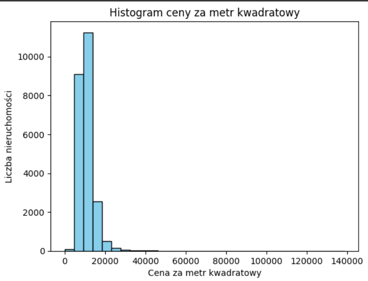
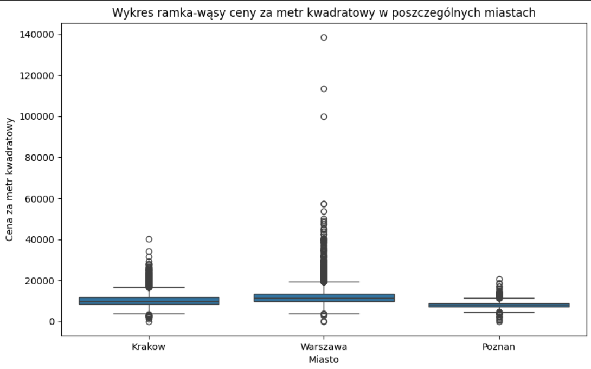
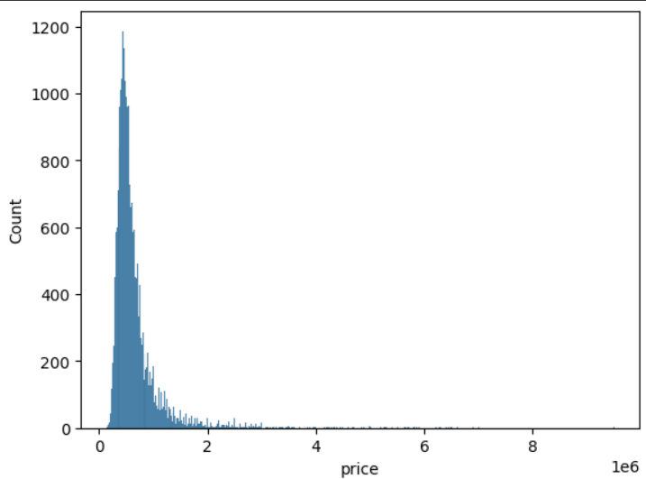
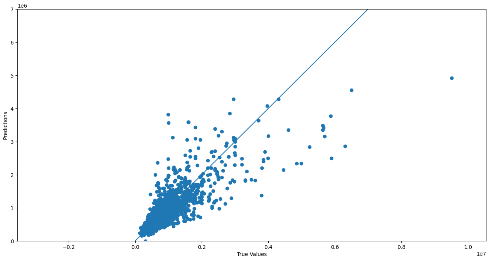
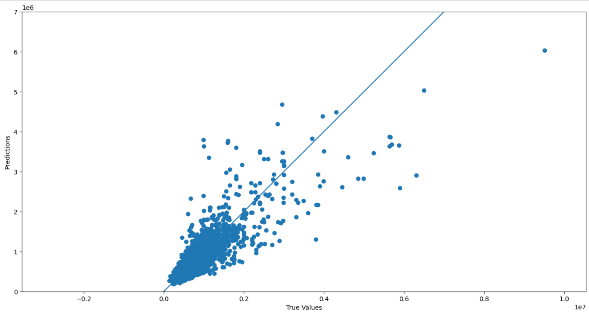
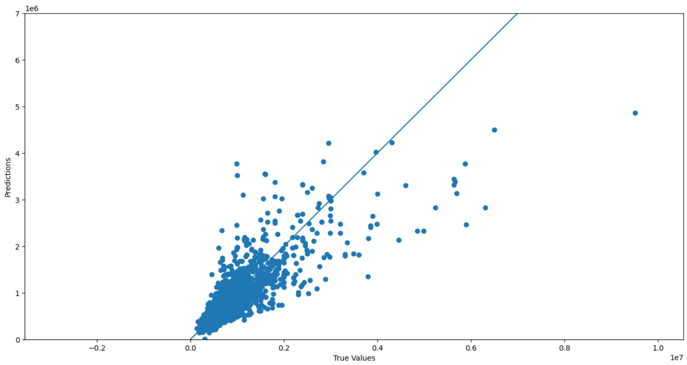

# House Price Predictor
## About project
The project is a university assignment implemented in a Jupyter Notebook environment. It aims to present a house price predictor specifically tailored for the Polish real estate market based on **neural networks**. The model tries to forecast house prices with high accuracy.

## Dataset
Kaggle page: https://www.kaggle.com/datasets/dawidcegielski/house-prices-in-poland

## Technologies
- Tools:
     - **Google Colab** with **Jupyter Notebook**
- Programming language: 
     - **Python**
- Libraries:
     - **Pandas** - for data manipulation and analysis
     - **NumPy** - for numerical calculations
     - **Matplotlib** - for creating charts and data visualization
     - **Seaborn** - for more advanced data visualizations
     - **Plotly Express** - for interactive charts
     - **TensorFlow** - for building and training neural networks
     - **Scikit-learn** - for data partitioning, standardization, model evaluation and outlier removal
- Framework:
     - **Keras** - for building neural network models
- Technology:
     - **Neural networks** - for predicting real estate prices
- Algorithm:
     - **Regression**
- Dataset source:
     - **Kaggle** (**csv** file)

## Solution
Wczytane dane:



Wyświetlenie wczytanych nieruchomości na mapie:



Histogram ceny za metr kwadratowy:



Wykres ramka-wąsy ceny za metr kwadratowy w poszczególnych miastach:



### Podział danych na wejściowe oraz wyjściowe:

Zmienne wejściowe:

- Zmienne ilościowe: **floor, latitude, longitude, rooms, sq, year, city_Krakow, city_Poznan, city_Warszawa**
- Zmienne jakościowe: -

Zmienna wyjściowa
- **price** (zmienna ilościowa)

```bash
X = data[['floor', 'latitude', 'longitude', 'rooms', 'sq', 'year', 'city_Krakow', 'city_Poznan', 'city_Warszawa']]
y = data['price']
```

Histogram dla zmiennej wyjściowej (price):



### Rozwiązywany problem

Rozwiązywany problem w tym przypadku to regresja. Celem jest przewidywanie cen nieruchomości na podstawie różnych cech, takich jak lokalizacja, liczba pokoi, metraż, rok budowy itp. W regresji staramy się znaleźć zależność między zmiennymi niezależnymi (cechami) a zmienną zależną (cena) w celu przewidzenia wartości numerycznej, czyli ceny nieruchomości.

### Podział danych na zbiory
- **Treningowy**: wykorzystywany do uczenia modelu.
- **Testowy**: służy do oceny skuteczności modelu po jego wytrenowaniu.

```bash
X_train, X_test, y_train, y_test = train_test_split(X, y, test_size=0.25, random_state=42)
```

### Zastosowane sieci neuronowe
- *Typ sieci:* Sieć neuronowa typu **Feedforward** (jednokierunkowa), wykorzystywana w regresji.
- *Architektura sieci:* **5 różnych architektur sieci neuronowych**, z których każda składa się z warstw gęstych. Każdy model różni się liczbą warstw oraz liczbą neuronów w każdej z warstw.
- *Ilość epok uczenia:* Każdy model jest trenowany przez **100 epok**.
- *Sposób uczenia sieci:* Na wstępie tworzony jest zestaw modeli, z różnymi architekturami sieci neuronowej. Sieć jest uczona za pomocą optymalizatora **Adam**, który dostosowuje współczynniki wag sieci w celu minimalizacji funkcji błędu średniokwadratowego (**MSE**). Funkcja błędu wykorzystana do treningu to **MSE** (Mean Squared Error), a jako metryka oceny wykorzystane są również **MAE** (Mean Absolute Error) oraz **R2 Score**. Każdy model jest trenowany na danych treningowych przez **100 epok** przy użyciu rozmiaru paczki (**batch size**) równego **32**. Dodatkowo, **20%** danych treningowych jest wykorzystywane jako **zbiór walidacyjny**. Po zakończeniu trenowania każdy model jest oceniany na zbiorze treningowym i testowym. Wyniki predykcji dla zbioru testowego są wizualizowane za pomocą wykresu punktowego, gdzie osie reprezentują rzeczywiste wartości oraz predykcje. Idealny model powinien prezentować się jako linia prosta, która idealnie dopasowuje się do punktów.


```bash
models = []
```

**Model 1**:
```bash
model1 = Sequential([
    Dense(64, activation='relu', input_shape=(X_train.shape[1],)),
    Dense(64, activation='relu'),
    Dense(1)
])
models.append(model1)
```

**Model 2**:
```bash
model2 = Sequential([
    Dense(128, activation='relu', input_shape=(X_train.shape[1],)),
    Dense(128, activation='relu'),
    Dense(64, activation='relu'),
    Dense(1)
])
models.append(model2)
```

**Model 3**:
```bash
model3 = Sequential([
    Dense(64, activation='relu', input_shape=(X_train.shape[1],)),
    Dense(64, activation='relu'),
    Dropout(0.2),
    Dense(1)
])
models.append(model3)
```

**Model 4**:
```bash
model4 = Sequential([
    Dense(64, activation='relu', input_shape=(X_train.shape[1],)),
    Dense(128, activation='relu'),
    Dense(64, activation='relu'),
    Dense(1)
])
models.append(model4)
```

**Model 5**:
```bash
model5 = Sequential([
    Dense(64, activation='relu', input_shape=(X_train.shape[1],)),
    Dense(64, activation='relu'),
    Dense(64, activation='relu'),
    Dense(64, activation='relu'),
    Dense(1)
])
models.append(model5)
```


### Trenowanie modelów i wyświetlenie wyników

```bash
for i, model in enumerate(models, start=1):
    print(f'Model {i}')

    model.compile(optimizer='adam', loss='mse', metrics=['mae'])
    history = model.fit(X_train, y_train, epochs=100, batch_size=32, validation_split=0.2, verbose=0)
    loss_train, mae_train = model.evaluate(X_train, y_train, verbose=0)
    loss_test, mae_test = model.evaluate(X_test, y_test, verbose=0)
    y_pred_train = model.predict(X_train)
    y_pred_test = model.predict(X_test)

    print("\nZBIÓR TRENINGOWY(UCZĄCY):")
    print('Średnia wartość bezwzględna róznicy(MAE)', mae_train)
    print('Średnia wartość kwadratu różnicy(MSE):', loss_train)
    print('Średni błąd modelu(RMSE):', np.sqrt(loss_train))
    print("Współczynnik determinacji(R2):", r2_score(y_train, y_pred_train))

    print("\nZBIÓR TESTUJĄCY:")
    print('Średnia wartość bezwzględna róznicy(MAE)', mae_test)
    print('Średnia wartość kwadratu różnicy(MSE):', loss_test)
    print('Średni błąd modelu(RMSE)::', np.sqrt(loss_test))
    print("Współczynnik determinacji(R2):", r2_score(y_test, y_pred_test))

    plt.figure(figsize=(16, 8))
    plt.scatter(y_test, y_pred_test)
    plt.xlabel('True Values')
    plt.ylabel('Predictions')
    plt.axis('equal')
    plt.xlim(0, 7000000)
    plt.ylim(0, 7000000)
    _ = plt.plot([0, 7000000], [0, 7000000])
    plt.show()
```

**Model 1**:
- **Zbiór treningowy:**
    * MAE: 133382.21875
    * MSE: 67452256256.0
    * RMSE: 259715.7220038864
    * R2: 0.6799250734982716
- **Zbiór testowy:**
    * MAE: 131144.328125
    * MSE: 65625067520.0
    * RMSE: 256173.9009345019
    * R2: 0.7059435631757701




**Model 2**:
- **Zbiór treningowy:**
    * MAE: 127108.5625
    * MSE: 60705611776.0
    * RMSE: 246385.0883799586
    * R2: 0.7119394830095441
- **Zbiór testowy:**
    * MAE: 125159.0859375
    * MSE: 58691358720.0
    * RMSE: 242262.99494557563
    * R2: 0.7370125469520319




**Model 3**:
- **Zbiór treningowy:**
    * MAE: 132783.75
    * MSE: 67626471424.0
    * RMSE: 260050.90160197485
    * R2: 0.6790983662673938
- **Zbiór testowy:**
    * MAE: 130958.796875
    * MSE: 65878700032.0
    * RMSE: 256668.46325951305
    * R2: 0.7048071599283495




**Model 4**:
- **Zbiór treningowy:**
    * MAE: 126462.9453125
    * MSE: 61010079744.0
    * RMSE: 247002.18570692852
    * R2: 0.7104945113348253
- **Zbiór testowy:**
    * MAE: 124352.7578125
    * MSE: 59110133760.0
    * RMSE: 243125.7570887955
    * R2: 0.7351361058748898


**Model 5**:
- **Zbiór treningowy:**
    * MAE: 123051.4453125
    * MSE: 56869249024.0
    * RMSE: 238472.74272754948
    * R2: 0.7301435949288448
- **Zbiór testowy:**
    * MAE: 121221.3515625
    * MSE: 53265031168.0
    * RMSE: 230792.18177399336
    * R2: 0.7613271683648691


### Wnioski

Model 5 wydaje się być najlepszym modelem, osiągając najniższe błędy oraz najwyższy współczynnik determinacji na obu zbiorach danych. Współczynnik determinacji (R2) dla wszystkich modeli oscyluje wokół 0.70, co oznacza, że modele są w stanie wyjaśnić około 70% zmienności danych, co jest umiarkowanie zadowalające. Modele 2, 4 i 5 wykazują lepsze wyniki niż modele 1 i 3 zarówno na zbiorze treningowym, jak i testowym, wyrażone niższymi błędami (MAE, MSE, RMSE) oraz wyższym współczynnikiem determinacji (R2). Modele 2, 4 i 5 mogą być preferowanymi modelami. Podsumowując, wyniki nie są idealne, lecz są satysfakcjonujące.

### Propozycje dalszego rozwoju projektu
- Dalsze testowanie różnych architektur sieci neuronowych oraz hiperparametrów, w celu znalezienia optymalnego modelu z lepszymi wynikami.
- Testowanie innych algorytmów uczenia maszynowego, które mogą dobrze radzić sobie z danymi i przewidywaniami cen mieszkań.
- Eksploracja dodatkowych cech, które mogą poprawić jakość przewidywań.
- Zastosowanie bardziej zaawansowanych technik optymalizacji, takich jak optymalizacja gęstości sieci, aby zoptymalizować wydajność modelu.
- Zastosowanie zaawansowanych technik regularyzacji, aby uniknąć przetrenowania.